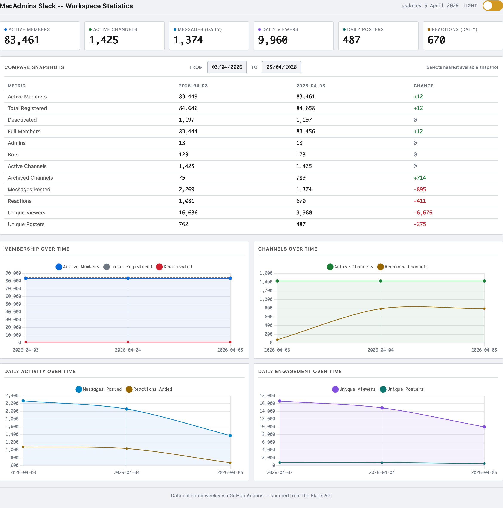

# slack-status

Workspace statistics dashboard for the MacAdmins Slack. Collects membership, channel, and activity data from the Slack API daily and publishes an interactive dashboard via GitHub Pages.



## What it tracks

- **Membership**: active members, total registered, deactivated, full members, guests, admins, owners, bots
- **Channels**: total, active, archived (public channels)
- **Daily activity**: messages posted, reactions added, unique viewers, unique posters (sourced from Slack's channel analytics)

Data is collected once per day at 10:00 UTC and appended to a historical data store. The dashboard displays current values, trend charts over time, and a snapshot comparison tool with date pickers.

## Dashboard

Live at: https://macadminsdotorg.github.io/slack-status/

Features:

- Dark / light / system theme toggle (persists to browser)
- Interactive Chart.js trend lines for membership, channels, activity, and engagement
- Date-picker comparison panel with nearest-snapshot matching and delta indicators
- Tooltips on all metrics explaining what is and is not included

## How it works

1. **`slack-stats.py`** connects to the Slack API using a User Token (`xoxp-`) and collects a snapshot of workspace statistics. The user list (~84k members) takes approximately 35 minutes to paginate due to API rate limits.

2. **`generate-dashboard.py`** merges the snapshot into `data/history.json` and generates a self-contained static HTML dashboard at `docs/index.html`.

3. **`.github/workflows/daily-stats.yml`** runs both scripts daily, commits the updated data, and deploys to GitHub Pages.

## Setup

### Prerequisites

- Python 3.11+
- A Slack app with these **User Token Scopes**: `users:read`, `users:read.email`, `admin.analytics:read`, `files:read`
- Optionally a **Bot Token** with `users:read` for the user list (falls back to the user token)

### Local development

```bash
cp .env.example .env
# Fill in SLACK_USER_TOKEN (and optionally SLACK_BOT_TOKEN)
pip install -r requirements.txt

# Run the stats collector
python slack-stats.py

# Or generate a snapshot and build the dashboard
OUTPUT_FORMAT=snapshot OUTPUT_FILE=output/snapshot.json python slack-stats.py
python generate-dashboard.py --snapshot-file output/snapshot.json
open docs/index.html
```

### GitHub Actions

Add these repository secrets:

- `SLACK_USER_TOKEN` -- the `xoxp-` user OAuth token
- `SLACK_BOT_TOKEN` -- (optional) the `xoxb-` bot token

Enable GitHub Pages with **Source: GitHub Actions** in the repository settings.

The workflow runs daily at 10:00 UTC and can also be triggered manually from the Actions tab.

## Output formats

Set `OUTPUT_FORMAT` to control output:

| Format | Description |
|--------|-------------|
| `text` | Human-readable report (default) |
| `json` | Full JSON with all stats |
| `csv` | Flat CSV row for spreadsheet import |
| `snapshot` | Compact JSON for historical storage (used by the dashboard pipeline) |

## Known limitations

- **Member analytics** (`admin.analytics.getFile` type=member) is blocked by the `org_level_email_display_disabled` workspace setting. Per-user activity breakdowns are not available until this is enabled.
- **Private channels** are not included. The `admin.conversations:read` scope required for workspace-wide private channel enumeration is only available on Enterprise Grid plans.
- **All-time message totals** are not exposed by the Slack API. Cumulative totals are built over time from daily snapshots.
- **Analytics lag**: Slack's channel analytics are typically available 2 days after the activity date.

## Related projects

- [slack-ploughshare](https://github.com/matdotcx/slack-ploughshare) -- Channel analytics and cleanup automation
